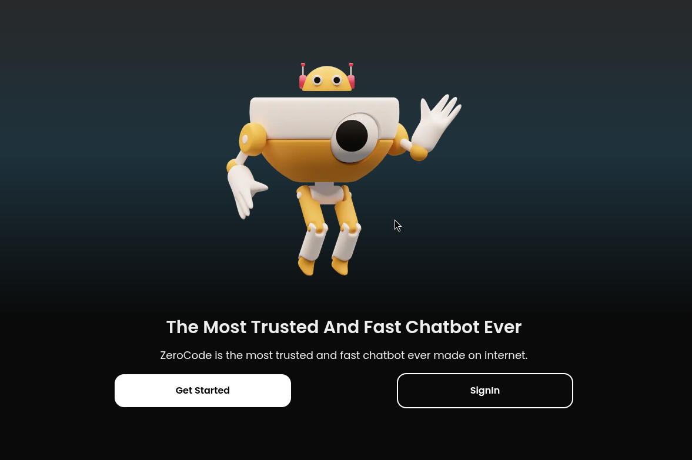
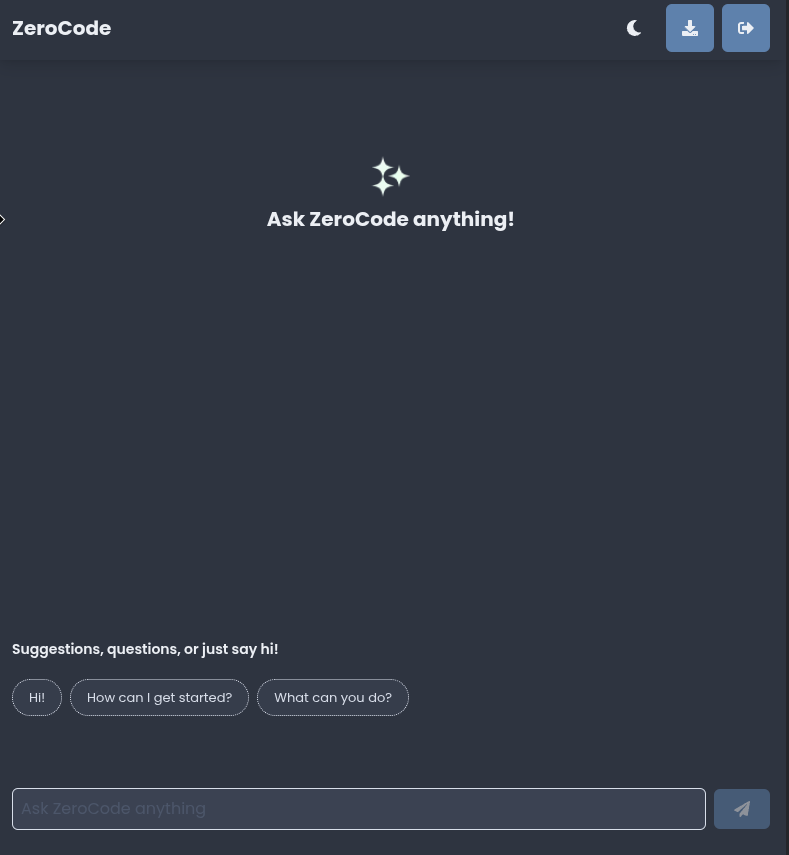
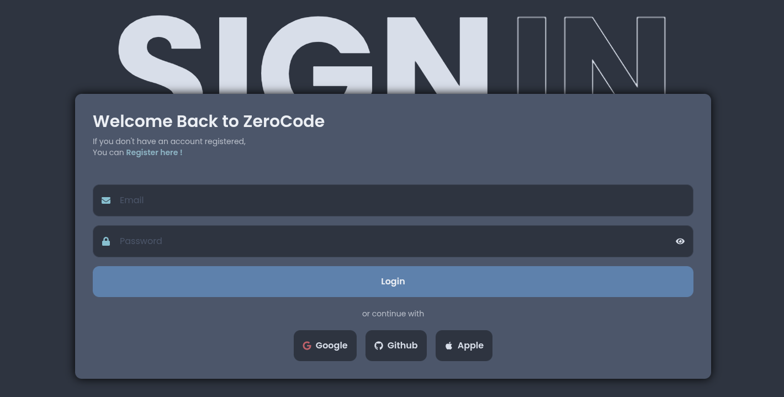
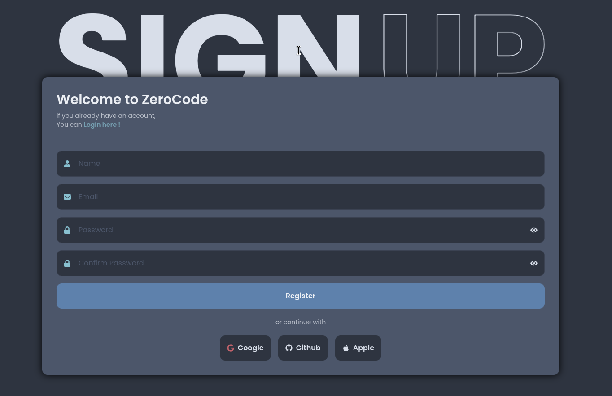

# 🤖 ZeroCode - AI-Powered Chatbot

<div align="center">
  
  
  [](https://nextjs.org/)
  [](https://www.typescriptlang.org/)
  [](https://tailwindcss.com/)
  [](https://supabase.com/)
  [](https://vercel.com/)
</div>

## 📖 Overview

ZeroCode is a modern, AI-powered chatbot built with Next.js 15, TypeScript, and Tailwind CSS. It provides an intuitive interface for users to interact with an AI assistant that specializes in coding and development questions. The application features real-time chat, message persistence, and seamless authentication.

## 📸 Screenshots

<div align="center">
  
  ### 🖥️ **Application Overview**
  
  
  ### 💬 **Chat Interface**
  
  
  ### 🔐 **Authentication Pages**
  <table>
    <tr>
      <td align="center">
        
        <br><strong>Login Page</strong>
      </td>
      <td align="center">
        
        <br><strong>Registration Page</strong>
      </td>
    </tr>
  </table>
  
</div>

## ✨ Features

### 🎨 **Modern UI/UX**

- Smooth animations and transitions
- Custom scrollbars and loading animations
- Intuitive chat interface with message bubbles

### 🤖 **AI Integration**

- Powered by Cohere's AI models for intelligent responses
- Fallback to dummy responses when API limits are reached
- Real-time message processing with loading states
- Context-aware responses for coding questions

### 🔐 **Authentication**

- Secure user authentication with Supabase
- Social login support (Google, GitHub)
- Session management and protected routes
- Automatic redirect for authenticated users

### 💾 **Data Persistence**

- Chat history saved to Supabase database
- Message export functionality
- Real-time message synchronization
- Persistent user sessions

### 🚀 **Performance**

- Built with Next.js 15 App Router
- Optimized images and fonts
- Server-side rendering for better SEO
- Efficient state management

## 🛠️ Tech Stack

- **Framework**: Next.js 15.3.3
- **Language**: TypeScript 5.0
- **Styling**: Tailwind CSS 4.0
- **Database**: Supabase (PostgreSQL)
- **Authentication**: Supabase Auth
- **AI Provider**: Cohere AI
- **Deployment**: Vercel
- **Icons**: React Icons
- **State Management**: React Hooks

## 🚀 Getting Started

### Prerequisites

- Node.js 18+
- npm, yarn, pnpm, or bun
- Supabase account
- Cohere API key (optional)

### Installation

1. **Clone the repository**

   ```bash
   git clone https://github.com/yourusername/zerocode-fe-assignment.git
   cd zerocode-fe-assignment
   ```

2. **Install dependencies**

   ```bash
   npm install
   # or
   yarn install
   # or
   pnpm install
   ```

3. **Set up environment variables**
   Create a `.env.local` file in the root directory:

   ```env
   NEXT_PUBLIC_SUPABASE_URL=your_supabase_url
   NEXT_PUBLIC_SUPABASE_ANON_KEY=your_supabase_anon_key
   COHERE_API_KEY=your_cohere_api_key
   ```

4. **Set up Supabase**

   - Create a new project at [supabase.com](https://supabase.com)
   - Create a `chats` table with the following schema:
     ```sql
     CREATE TABLE chats (
       id SERIAL PRIMARY KEY,
       user_id UUID REFERENCES auth.users(id),
       role TEXT NOT NULL,
       message TEXT NOT NULL,
       created_at TIMESTAMP WITH TIME ZONE DEFAULT NOW()
     );
     ```
   - Enable Row Level Security (RLS) and create policies

5. **Configure OAuth providers** (optional)

   - Set up Google OAuth in Google Cloud Console
   - Configure GitHub OAuth in GitHub Developer Settings
   - Add credentials to Supabase Authentication settings

6. **Run the development server**

   ```bash
   npm run dev
   # or
   yarn dev
   ```

7. **Open your browser**
   Navigate to [http://localhost:3000](http://localhost:3000)

## 📁 Project Structure

```
zerocode-fe-assignment/
├── app/
│   ├── api/
│   │   └── chat/
│   │       └── route.ts          # AI chat API endpoint
│   ├── auth/
│   │   └── callback/
│   │       └── route.ts          # OAuth callback handler
│   ├── chat/
│   │   └── page.tsx              # Main chat interface
│   ├── components/
│   │   └── LoadingDots.tsx       # Loading animation component
│   ├── signin/
│   │   └── page.tsx              # Sign in page
│   ├── register/
│   │   └── page.tsx              # Registration page
│   ├── globals.css               # Global styles
│   ├── layout.tsx                # Root layout
│   └── page.tsx                  # Landing page
├── lib/
│   ├── chatBot.ts                # AI integration logic
│   └── supabase.ts               # Supabase client configuration
├── public/
│   ├── hero-logo.png             # Main logo
│   ├── logo.png                  # App logo
│   ├── zeroCode-fs.png           # Full screen screenshot
│   ├── zeroCode-chat.png         # Chat interface screenshot
│   ├── zeroCode-li.png           # Login page screenshot
│   ├── zeroCode-re.png           # Registration page screenshot
│   └── ...                       # Other assets
└── package.json
```

## 🔧 Configuration

### Environment Variables

| Variable                        | Description                 | Required           |
| ------------------------------- | --------------------------- | ------------------ |
| `NEXT_PUBLIC_SUPABASE_URL`      | Your Supabase project URL   | Yes                |
| `NEXT_PUBLIC_SUPABASE_ANON_KEY` | Your Supabase anonymous key | Yes                |
| `COHERE_API_KEY`                | Cohere AI API key           | No (uses fallback) |

### Database Schema

The application uses a simple `chats` table to store conversation history:

```sql
CREATE TABLE chats (
  id SERIAL PRIMARY KEY,
  user_id UUID REFERENCES auth.users(id),
  role TEXT NOT NULL CHECK (role IN ('user', 'bot')),
  message TEXT NOT NULL,
  created_at TIMESTAMP WITH TIME ZONE DEFAULT NOW()
);
```

## 🚀 Deployment

### Deploy to Vercel

1. Push your code to GitHub
2. Connect your repository to Vercel
3. Add environment variables in Vercel dashboard
4. Deploy!

### Environment Variables for Production

Make sure to update your environment variables for production:

```env
NEXT_PUBLIC_APP_URL=https://your-domain.vercel.app
```

## 🎯 Features in Detail

### Chat Interface

- Real-time message display
- User and bot message differentiation
- Loading animations with custom dots
- Message export functionality
- Responsive design for all devices

### Authentication Flow

- Email/password registration and login
- Social OAuth integration
- Automatic session management
- Protected route redirects

### AI Integration

- Intelligent response generation
- Fallback responses for API limits
- Context-aware conversations
- Error handling and recovery

## 🤝 Contributing

1. Fork the repository
2. Create a feature branch (`git checkout -b feature/amazing-feature`)
3. Commit your changes (`git commit -m 'Add amazing feature'`)
4. Push to the branch (`git push origin feature/amazing-feature`)
5. Open a Pull Request

## 📝 License

This project is licensed under the MIT License - see the [LICENSE](LICENSE) file for details.

## 🙏 Acknowledgments

- [Next.js](https://nextjs.org/) for the amazing framework
- [Supabase](https://supabase.com/) for backend services
- [Cohere](https://cohere.ai/) for AI capabilities
- [Tailwind CSS](https://tailwindcss.com/) for styling
- [Vercel](https://vercel.com/) for deployment

## 📞 Support

If you have any questions or need help, please:

- Open an issue on GitHub
- Contact the development team
- Check the documentation

---

<div align="center">
  Made with ❤️ by Nikhil
</div>
